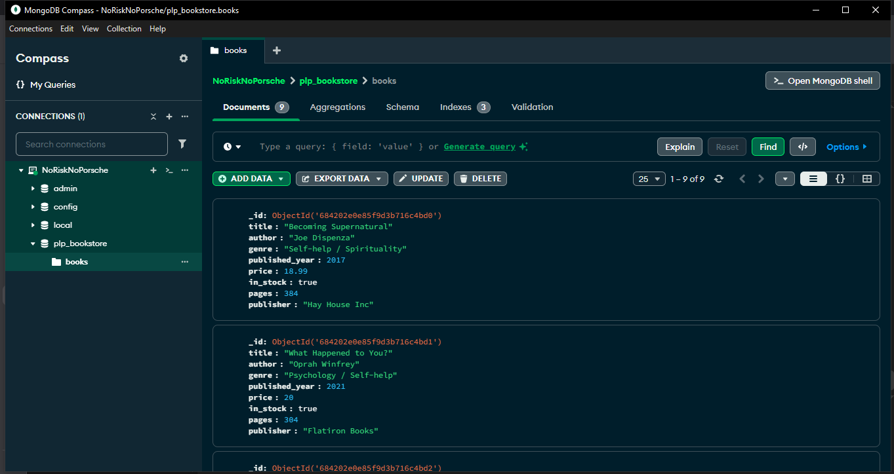

# 📚 PLP Bookstore – MongoDB Learning Project

Welcome to the **PLP Bookstore MongoDB Project**, a hands-on journey to mastering MongoDB fundamentals using a realistic dataset of books. This project covers everything from installation and data insertion to advanced queries, aggregation pipelines, and performance optimization through indexing.



---

## 🚀 Objective

Gain practical experience with MongoDB by:

* Setting up and configuring a MongoDB environment
* Creating and managing collections
* Performing CRUD operations on a dataset of books
* Running advanced queries including sorting and pagination
* Using aggregation pipelines for analytics
* Implementing indexing to improve query performance

---

## 📂 Project Structure

This project focuses on a single collection: `books` in a database called `plp_bookstore`. The collection consists of 10+ documents representing real-world book data.

---

## ⚙️ Task 1: Setup

### Option 1: Local Installation

1. Install MongoDB from [mongodb.com](https://www.mongodb.com/try/download/community)
2. Start the server: `mongod`
3. Connect using: `mongosh`

### Option 2: MongoDB Atlas

1. Sign up at [MongoDB Atlas](https://www.mongodb.com/cloud/atlas)
2. Create a free cluster and add a new database: `plp_bookstore`
3. Add a collection: `books`

---

## ✍️ Task 2: Basic CRUD Operations

### 📝 Insert Documents

Used the following `insertMany` command to populate the `books` collection with 10 documents:

```js
db.books.insertMany([
  {
    title: 'Becoming Supernatural',
    author: 'Joe Dispenza',
    genre: 'Self-help / Spirituality',
    published_year: 2017,
    price: 18.99,
    in_stock: true,
    pages: 384,
    publisher: 'Hay House Inc'
  },
  {
    title: 'What Happened to You?',
    author: 'Oprah Winfrey',
    genre: 'Psychology / Self-help',
    published_year: 2021,
    price: 20.00,
    in_stock: true,
    pages: 304,
    publisher: 'Flatiron Books'
  },
  // ...8 more books included
]);
```

### 🔍 Read Operations

* **Find all books in a specific genre:**

```js
db.books.find({ genre: "Self-help" });
```

* **Find books published after 2010:**

```js
db.books.find({ published_year: { $gt: 2010 } });
```

* **Find books by Paulo Coelho:**

```js
db.books.find({ author: "Paulo Coelho" });
```

### ✏️ Update Operation

* **Update the price of “The Alchemist”:**

```js
db.books.updateOne(
  { title: "The Alchemist" },
  { $set: { price: 19.99 } }
);
```

### ❌ Delete Operation

* **Delete the book “Who Moved My Cheese?”:**

```js
db.books.deleteOne({ title: "Who Moved My Cheese?" });
```

---

## 🔎 Task 3: Advanced Queries

### ✅ Filter, Project, Sort, and Paginate

* **Find books in stock and published after 2010:**

```js
db.books.find(
  { in_stock: true, published_year: { $gt: 2010 } },
  { title: 1, author: 1, price: 1, _id: 0 }
)
.sort({ price: 1 }) // Ascending
.limit(5)
.skip(0);           // Page 1
```

* **Page 2 (books 6–10):**

```js
.skip(5);
```

* **Sort by price (descending):**

```js
.sort({ price: -1 });
```

---

## 📊 Task 4: Aggregation Pipelines

### 📈 1. Average Price by Genre

```js
db.books.aggregate([
  {
    $group: {
      _id: "$genre",
      averagePrice: { $avg: "$price" },
      count: { $sum: 1 }
    }
  }
]);
```

### 👨‍💼 2. Author with Most Books

```js
db.books.aggregate([
  {
    $group: {
      _id: "$author",
      bookCount: { $sum: 1 },
      books: { $push: "$title" }
    }
  },
  { $sort: { bookCount: -1 } },
  { $limit: 1 }
]);
```

### 📅 3. Group Books by Publication Decade

```js
db.books.aggregate([
  {
    $addFields: {
      decade: {
        $subtract: [
          "$published_year",
          { $mod: ["$published_year", 10] }
        ]
      }
    }
  },
  {
    $group: {
      _id: "$decade",
      count: { $sum: 1 },
      books: { $push: "$title" }
    }
  }
]);
```

---

## ⚡ Task 5: Indexing for Performance

### 1. Create Index on Title

```js
db.books.createIndex({ title: 1 });
```

### 2. Compound Index on Author & Published Year

```js
db.books.createIndex({ author: 1, published_year: -1 });
```

### 3. Explain Plan for Query Performance

```js
db.books.find({ title: "The Alchemist" }).explain("executionStats");

db.books.find({
  author: "Paulo Coelho",
  published_year: { $gt: 2000 }
}).explain("executionStats");
```

---

## ✅ Outcomes

Through this project, you’ve learned how to:

* Build and populate a MongoDB database
* Run basic and advanced queries
* Perform data aggregation and reporting
* Use indexing to optimize performance

---

## 📘 Resources

* [MongoDB Documentation](https://www.mongodb.com/docs/)
* [MongoDB Aggregation Guide](https://www.mongodb.com/docs/manual/aggregation/)
* [MongoDB Indexing](https://www.mongodb.com/docs/manual/indexes/)

---
